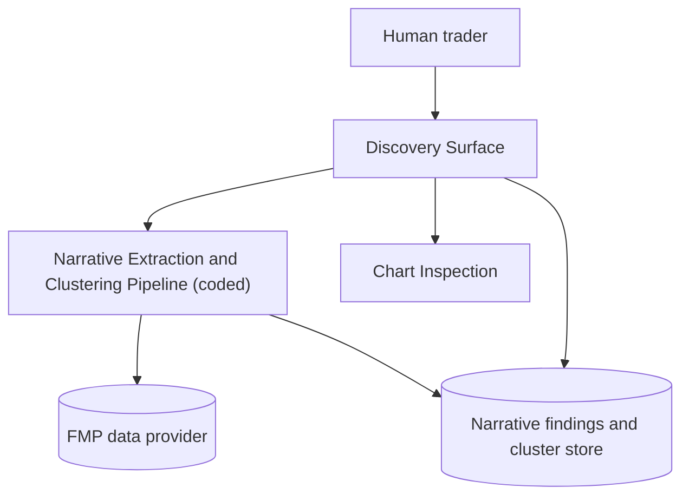

# Technical Trader Solution Architecture

## Purpose

Define the architecture foundations for the Technical Trader Solution, established with its
first capability: Narrative-Cluster Discovery Surface (US-015, backlog story 001). This document
is extended incrementally as further backlog stories are implemented.

## Problem Statement

- User need: the human trader needs narrative/topic findings across the eligible universe
  surfaced automatically, since none are pre-computed today (see
  `development/todos/001-trial-US-015.md`).
- Primary goal for this pass: a nightly, deterministic pipeline extracts and clusters narrative
  findings per ticker from FMP-sourced earnings reports, SEC filings, and news, and a discovery
  surface presents clusters, their tying storyline, and trend, with a path into chart inspection.
- Secondary goal: keep the extraction pipeline coded (deterministic, non-frontier) rather than an
  open-ended reasoning agent, since STR-011 requires the human trader to confirm any theme via
  chart inspection regardless -- the pipeline only needs to be a good-enough discovery aid, not a
  final decision-maker, and must run nightly across the full eligible universe economically.

## Principles

- The human trader always retains sole, final judgment over theme creation (STR-011, MB-020); no
  component of the Technical Trader Solution ever automatically creates a theme.
- Narrative extraction and clustering are deterministic and run on a nightly batch cadence,
  mirroring the methodology corpus's existing bond-network nightly cadence (MB-006, MB-007), so
  future capabilities can share one nightly execution model.
- Prefer coded, deterministic components over open-ended reasoning agents wherever the task is
  bounded and repeatable; reserve open-ended reasoning for capabilities that genuinely need it
  (none identified yet in this workspace).
- Tech-restricted vocabulary rules from `docs/methodology/glossary.md` apply across this
  document's audience: this architecture document may freely use technology terms (agent,
  pipeline, model, database), but no market-behavior, trading-strategy, or user-story functional
  content may.

## Operating Decision Record (US-015)

- Decision: build the narrative-extraction-and-clustering capability as a fixed nightly pipeline
  (`coded_agent`), not an open-ended or frontier-reasoning agent.
- Options considered:
  1. Fixed nightly pipeline (chosen).
  2. Flexible/exploratory frontier-reasoning step for judging narrative connections case by case.
  3. Fixed pipeline now, with a flexible reasoning step deferred to a follow-up story if the fixed
     pipeline proves too coarse.
- Rationale: reviewed directly with the human trader (2026-07-08). Since STR-011 requires
  chart-level human confirmation before any theme is created, the discovery surface only needs to
  be a good-enough lead generator; the fixed pipeline is materially cheaper and fast enough to run
  nightly across the full eligible universe, while a flexible reasoning step would be slower,
  costlier, and likely infeasible to run universe-wide every night. If the fixed pipeline later
  proves too coarse for a specific narrow subset of tickers, a flexible step can be added as a
  follow-up story (deferred, not designed here).

## Delivery Interface

- Decision: the Technical Trader Solution is delivered as a local web dashboard the human
  trader runs on their own machine, not a CLI-first or notebook-first tool, and not a plugin
  into a third-party charting platform.
- Options considered: (1) local web dashboard (chosen); (2) CLI plus notebook workflow; (3)
  feed data into an existing third-party charting platform.
- Rationale: confirmed directly with the human trader (2026-07-08). A local web dashboard
  supports interactive cluster browsing and side-by-side chart inspection with point-and-click
  navigation, matching how the human trader wants to work day to day; this choice governs the
  Discovery Surface's implementation and every future capability's presentation layer.
- Consequence: the Discovery Surface (and future capability surfaces) are pages or views inside
  one local web dashboard, backed by a shared Python core.

## Component Topology

### Narrative Extraction and Clustering Pipeline

Type: coded agent (LangGraph, ClaudeCode SDK base -- see Uniform SDK base-class decision below).

Responsibilities:

- Nightly: fetch each eligible-universe ticker's earnings reports, SEC filings, and news from the
  FMP data provider.
- Extract per-ticker narrative and topic findings.
- Run topic modeling over extracted findings to group tickers sharing or adjacent narratives,
  independent of pair-bond, sync, or theme status.
- For each cluster, produce a short topic label via one bounded model call, and compute its
  frequency-of-mention and company-breadth trend.
- Persist per-ticker narrative findings and cluster assignments for the Discovery Surface to read.

### Discovery Surface

Type: presentation and interaction capability; a page within the local web dashboard (see
Delivery Interface). Its own solution-surface classification is deferred to its
implementation-spec and task-plan pass; it is not itself an agent.

Responsibilities:

- Present narrative clusters to the human trader with their tying storyline or topic label and
  trend.
- Enable navigation from a cluster directly into side-by-side chart inspection of its members
  (STR-011 rules c and d) -- theme creation itself remains a human trader action outside this
  capability's scope.

## Uniform SDK Base-Class Decision

All coded agents built for the Technical Trader Solution use the ClaudeCode SDK agent base
(Anthropic-native), matching the agent-dev-agent tooling's own base-class decision, for
consistency across any coded components this workspace produces.

## Solution-Surface Classification

| Story | Capability | `top_level_runtime` | `subagent_topology` | Rationale |
| --- | --- | --- | --- | --- |
| 001 (US-015) | Narrative Extraction and Clustering Pipeline | instructed | `coded_agent` | Fixed-node pipeline (fetch, extract, cluster, label, persist); no open-ended planning or tool choice required; confirmed with the human trader on 2026-07-08 given STR-011's mandatory chart-confirmation step bounds the cost of a coarser mechanical clustering. |

`top_level_runtime` for the Technical Trader Solution is recorded here as `instructed` per the
top-level guardrail, represented by a lightweight orchestrator role introduced as future
capabilities require it. No dedicated top-level orchestrator component is being built in story
001 beyond what wires this one nightly pipeline and its discovery surface together.

## Logging and Error Handling (story 002)

Cross-cutting constraint applying to every current and future Technical Trader Solution
component and user surface (core, coded agents, CLI, SDK, MCP, and the dashboard).

- Entrance APIs: CLI, SDK, and MCP are the three entrance APIs, matching agent-dev-agent's own
  convention. The dashboard is not a fourth entrance API; it is a UI layer built on top of the
  SDK (see Delivery Interface and Discovery Surface above -- dashboard pages already call only
  `sdk.*` functions, never core or storage directly). The dashboard inherits `--log-dir` and
  `--log-level` behavior through its SDK dependency and additionally exposes both options on its
  own launch command (`tts dashboard serve`) for user convenience, so all four surfaces behave
  identically from the human trader's point of view without the dashboard being architecturally
  classified as an entrance API.
- Logging: every surface uses Python's standard `logging` module -- no bare `print()` and no
  new logging dependency. Log output never reaches stdout. All surfaces write to one shared log
  file per run, named `technical_trader_solution_<datetime>.log` (`<datetime>` fixed at
  process/session start so concurrent or repeated runs never overwrite each other's log), inside
  a `technical_trader_solution/` directory under the current working directory by default. Every
  entrance API (CLI, SDK, MCP) exposes the same `--log-dir <dir>` option to override the log
  directory and the same `--log-level [info, debug, warning, error]` option (default `info`) to
  control verbosity; the dashboard launch command exposes both for convenience, per the Entrance
  APIs decision above. No log retention or rotation policy is applied; log files accumulate and
  cleanup is manual.
- Error handling: layered by surface -- "domain exceptions" here means exceptions raised by the
  technical_trader_solution core layer to signal business-rule violations or invalid states
  (for example an unreachable data provider or an invalid cluster id), as distinct from
  unexpected framework or infrastructure exceptions.
  - the core layer raises domain exceptions and logs the exception class and reason before
    raising, so the error condition is captured even when a calling layer swallows or
    transforms it;
  - the SDK layer passes exceptions to the calling process unchanged;
  - the CLI layer catches domain exceptions, logs them, prints a user-facing error message to
    stderr, and exits with a non-zero code;
  - the MCP layer catches domain exceptions and reports the error message in the tool response;
  - the dashboard catches domain exceptions and surfaces an in-page error message.
  - CLI and MCP error messages use one unified message format and verbosity; the dashboard's
    in-page presentation follows the same underlying message text. The exact message template
    (field order, prefix conventions) is deferred to the implementation-spec pass, since the
    architecture-level constraint -- one shared message text and severity across all surfaces --
    is sufficient to guide that design without prescribing it here.
- Sensitive-data masking: log and error output must never include plaintext sensitive fields
  (API keys, credentials, PII); this never-plaintext policy is the architecture-level
  constraint. The concrete masked-fields list and masking technique are deliberately deferred to
  this story's implementation-spec and task-plan passes -- the policy alone is sufficient to
  guide implementation, and the deferral is safe because no code exists yet that would leak an
  undecided field in the interim.
- Rationale: without a shared, cross-cutting policy, each surface would invent its own logging
  and error-reporting convention, making nightly-pipeline and dashboard failures hard to debug
  and inconsistent for the human trader. Confirmed via backlog story 002 (development/todos/
  002-enhance-error-and-logging.md); this section governs every subsequent capability's
  logging and error-handling implementation, not just story 002's own changes. Story 002 itself
  instruments all existing surfaces (core, CLI, SDK, MCP, dashboard); every subsequent capability
  story must follow this policy for its own logging and error handling from the start. This
  document has no separate Quality Attributes table; this section is the single source of truth
  for the Technical Trader Solution's logging and error-handling posture.

## Non-Functional Constraints

- Data provider: FMP (existing API access), for earnings reports, SEC filings, and news coverage.
- Cadence: nightly batch, aligned with the existing bond-network computation cadence described in
  the methodology corpus.
- Vocabulary: this document follows `docs/methodology/glossary.md`. Downstream implementation-spec
  and user-story content must keep tech-restricted terms (agent, pipeline, database, etc.) out of
  functional and user-story content per the glossary's hard rule.
- Logging and error handling: see the dedicated Logging and Error Handling section above.

## Open Items

- Story 002's masked-fields list and masking technique remain undecided pending
  implementation-spec and task-plan work.
- Future stories (bond network, sync rank surfaces, theme maintenance, etc.) will extend this
  document's Component Topology and Solution-Surface Classification table as they are
  architected.

## Change Log

- v0.1 (2026-07-08) -- initial architecture pass, scoped to story 001 (US-015 Narrative-Cluster
  Discovery Surface). Solution-surface classification `coded_agent` confirmed with the human
  trader.
- v0.2 (2026-07-08) -- added Delivery Interface decision: the Technical Trader Solution is a
  local web dashboard, confirmed with the human trader. Updated Discovery Surface to record it
  as a page within that dashboard.
- v0.3 (2026-07-14) -- added the Logging and Error Handling cross-cutting constraint (story 002,
  development/todos/002-enhance-error-and-logging.md): shared log file location and `--log-dir`
  override across CLI/SDK/MCP/dashboard, layered exception handling per surface, unified
  CLI/MCP error-message formatting, and deferred masked-fields specification.
- v0.4 (2026-07-14) -- resolved story-002 architecture review findings: clarified CLI/SDK/MCP as
  the three entrance APIs with the dashboard as a UI layer over the SDK (not a fourth entrance
  API); adopted the `technical_trader_solution_<datetime>.log` naming convention and the
  `--log-level [info, debug, warning, error]` option (default `info`) alongside `--log-dir`;
  defined "domain exceptions"; made the masked-fields and message-template deferrals explicit
  with rationale.
