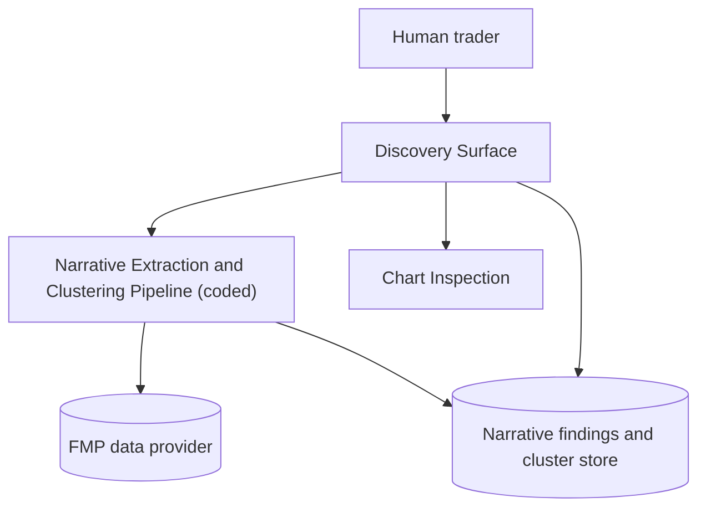

# Technical Trader Solution Architecture

## Purpose

Define the architecture foundations for the Technical Trader Solution, established with its
first capability: Narrative-Cluster Discovery Surface (US-015, backlog story 001). This document
is extended incrementally as further backlog stories are implemented.

## Problem Statement

- User need: the human trader needs narrative/topic findings across the eligible universe
  surfaced automatically, since none are pre-computed today (see
  `development/todos/001-trial-US-015.md`).
- Primary goal for this pass: a nightly, deterministic pipeline extracts and clusters narrative
  findings per ticker from FMP-sourced earnings reports, SEC filings, and news, and a discovery
  surface presents clusters, their tying storyline, and trend, with a path into chart inspection.
- Secondary goal: keep the extraction pipeline coded (deterministic, non-frontier) rather than an
  open-ended reasoning agent, since STR-011 requires the human trader to confirm any theme via
  chart inspection regardless -- the pipeline only needs to be a good-enough discovery aid, not a
  final decision-maker, and must run nightly across the full eligible universe economically.

## Principles

- The human trader always retains sole, final judgment over theme creation (STR-011, MB-020); no
  component of the Technical Trader Solution ever automatically creates a theme.
- Narrative extraction and clustering are deterministic and run on a nightly batch cadence,
  mirroring the methodology corpus's existing bond-network nightly cadence (MB-006, MB-007), so
  future capabilities can share one nightly execution model.
- Prefer coded, deterministic components over open-ended reasoning agents wherever the task is
  bounded and repeatable; reserve open-ended reasoning for capabilities that genuinely need it
  (none identified yet in this workspace).
- Tech-restricted vocabulary rules from `docs/methodology/glossary.md` apply across this
  document's audience: this architecture document may freely use technology terms (agent,
  pipeline, model, database), but no market-behavior, trading-strategy, or user-story functional
  content may.

## Operating Decision Record (US-015)

- Decision: build the narrative-extraction-and-clustering capability as a fixed nightly pipeline
  (`coded_agent`), not an open-ended or frontier-reasoning agent.
- Options considered:
  1. Fixed nightly pipeline (chosen).
  2. Flexible/exploratory frontier-reasoning step for judging narrative connections case by case.
  3. Fixed pipeline now, with a flexible reasoning step deferred to a follow-up story if the fixed
     pipeline proves too coarse.
- Rationale: reviewed directly with the human trader (2026-07-08). Since STR-011 requires
  chart-level human confirmation before any theme is created, the discovery surface only needs to
  be a good-enough lead generator; the fixed pipeline is materially cheaper and fast enough to run
  nightly across the full eligible universe, while a flexible reasoning step would be slower,
  costlier, and likely infeasible to run universe-wide every night. If the fixed pipeline later
  proves too coarse for a specific narrow subset of tickers, a flexible step can be added as a
  follow-up story (deferred, not designed here).

## Component Topology

### Narrative Extraction and Clustering Pipeline

Type: coded agent (LangGraph, ClaudeCode SDK base -- see Uniform SDK base-class decision below).

Responsibilities:

- Nightly: fetch each eligible-universe ticker's earnings reports, SEC filings, and news from the
  FMP data provider.
- Extract per-ticker narrative and topic findings.
- Run topic modeling over extracted findings to group tickers sharing or adjacent narratives,
  independent of pair-bond, sync, or theme status.
- For each cluster, produce a short topic label via one bounded model call, and compute its
  frequency-of-mention and company-breadth trend.
- Persist per-ticker narrative findings and cluster assignments for the Discovery Surface to read.

### Discovery Surface

Type: presentation and interaction capability. Its own solution-surface classification is
deferred to its implementation-spec and task-plan pass; it is not itself an agent.

Responsibilities:

- Present narrative clusters to the human trader with their tying storyline or topic label and
  trend.
- Enable navigation from a cluster directly into side-by-side chart inspection of its members
  (STR-011 rules c and d) -- theme creation itself remains a human trader action outside this
  capability's scope.

## Uniform SDK Base-Class Decision

All coded agents built for the Technical Trader Solution use the ClaudeCode SDK agent base
(Anthropic-native), matching the agent-dev-agent tooling's own base-class decision, for
consistency across any coded components this workspace produces.

## Solution-Surface Classification

| Story | Capability | `top_level_runtime` | `subagent_topology` | Rationale |
| --- | --- | --- | --- | --- |
| 001 (US-015) | Narrative Extraction and Clustering Pipeline | instructed | `coded_agent` | Fixed-node pipeline (fetch, extract, cluster, label, persist); no open-ended planning or tool choice required; confirmed with the human trader on 2026-07-08 given STR-011's mandatory chart-confirmation step bounds the cost of a coarser mechanical clustering. |

`top_level_runtime` for the Technical Trader Solution is recorded here as `instructed` per the
top-level guardrail, represented by a lightweight orchestrator role introduced as future
capabilities require it. No dedicated top-level orchestrator component is being built in story
001 beyond what wires this one nightly pipeline and its discovery surface together.

## Non-Functional Constraints

- Data provider: FMP (existing API access), for earnings reports, SEC filings, and news coverage.
- Cadence: nightly batch, aligned with the existing bond-network computation cadence described in
  the methodology corpus.
- Vocabulary: this document follows `docs/methodology/glossary.md`. Downstream implementation-spec
  and user-story content must keep tech-restricted terms (agent, pipeline, database, etc.) out of
  functional and user-story content per the glossary's hard rule.

## Open Items

- None for story 001. Future stories (bond network, sync rank surfaces, theme maintenance, etc.)
  will extend this document's Component Topology and Solution-Surface Classification table as
  they are architected.

## Change Log

- v0.1 (2026-07-08) -- initial architecture pass, scoped to story 001 (US-015 Narrative-Cluster
  Discovery Surface). Solution-surface classification `coded_agent` confirmed with the human
  trader.
